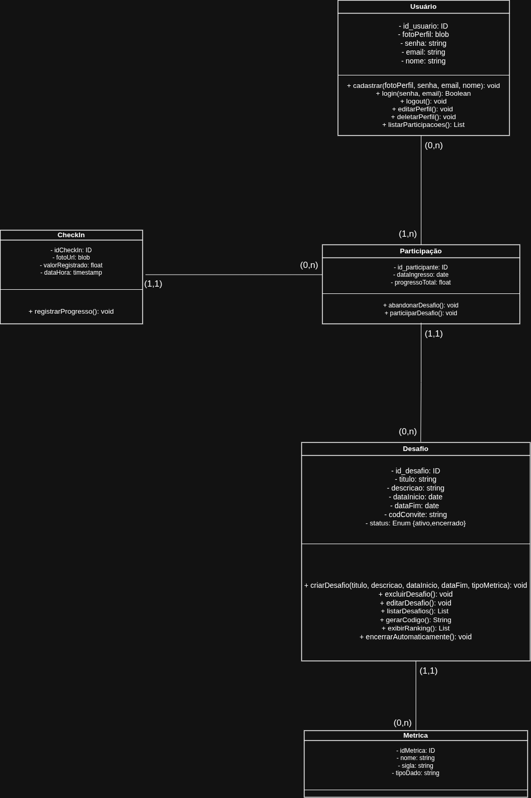
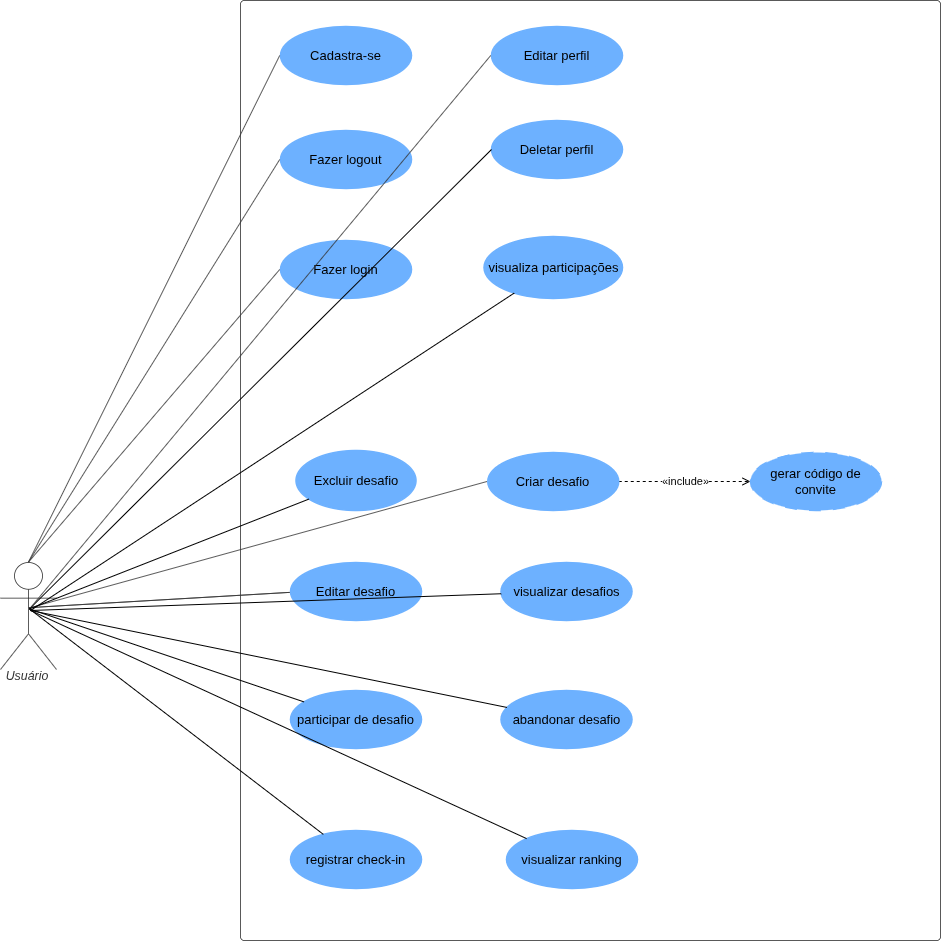

# FITEND

## Mini Mundo

O Fit End é uma plataforma de gamificação voltada para a criação e gestão de desafios de hábitos entre amigos. O foco é permitir que usuários criem competições saudáveis baseadas em métricas variadas (como ingestão de água, exercícios físicos ou leitura), incentivando a constância através de rankings e registros de progresso.
Para utilizar o sistema, o indivíduo deve realizar um cadastro fornecendo seu nome completo, e-mail, uma senha segura e, opcionalmente, uma foto de perfil. O sistema identifica cada usuário de forma única através de um identificador interno.
Qualquer usuário cadastrado pode atuar como um "Criador". Ao criar um Desafio, o usuário define um título, uma descrição detalhada, a data de início e a data de término da competição. No momento da criação, o sistema gera automaticamente um Código de Convite único, que será utilizado para que outros amigos entrem no desafio.
Cada desafio pertence obrigatoriamente a um único criador, que possui permissões administrativas sobre ele. O desafio possui um status (ex: Pendente, Ativo, Encerrado, Cancelado), permitindo que o criador encerre ou cancele o desafio manualmente antes da data final estipulada.
Para garantir a integridade dos dados, cada desafio deve estar vinculado a uma Métrica pré-definida e gerida exclusivamente pela administração do sistema (não pelos usuários comuns). Uma métrica define o nome (ex: Quilômetros), a sigla (ex: km) e o tipo de dado esperado (ex: numérico ou booleano). Isso garante padronização nos registros de todos os desafios da plataforma.
Um usuário pode participar de múltiplos desafios simultaneamente ao inserir o código de convite correspondente. Ao ingressar, o sistema registra a data de ingresso do participante. Para cada desafio em que está inscrito, o usuário possui um progresso total. Este é um atributo derivado, ou seja, não é um dado solto, mas sim calculado matematicamente a partir da soma de todas as entregas realizadas por aquele usuário naquele desafio.
O coração do sistema é o Check-in. Durante o período de vigência de um desafio ativo, o participante deve realizar registros de suas atividades. Em cada check-in, o usuário informa o valor realizado (ex: 500 para ml d'água), a data/hora do registro e pode anexar uma foto como comprovante visual da atividade. Cada check-in está estritamente ligado à participação daquele usuário naquele desafio específico.
O sistema utiliza os dados dos check-ins para gerar rankings de desempenho entre os participantes do desafio em tempo real.

## Modelo Conceitual

  <h3>Esquema Conceitual</h3>
  

  <h3>Diagrama de Classes</h3>
  

  <h3>Diagrama de Caso de Uso</h3>
  

