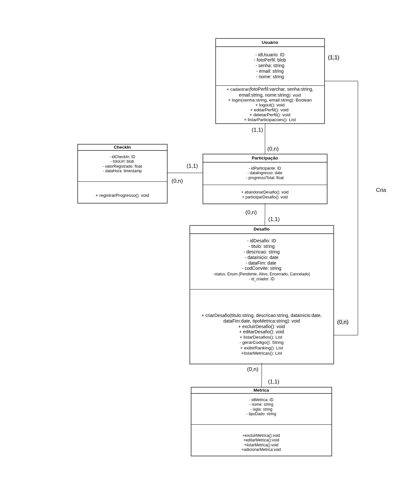
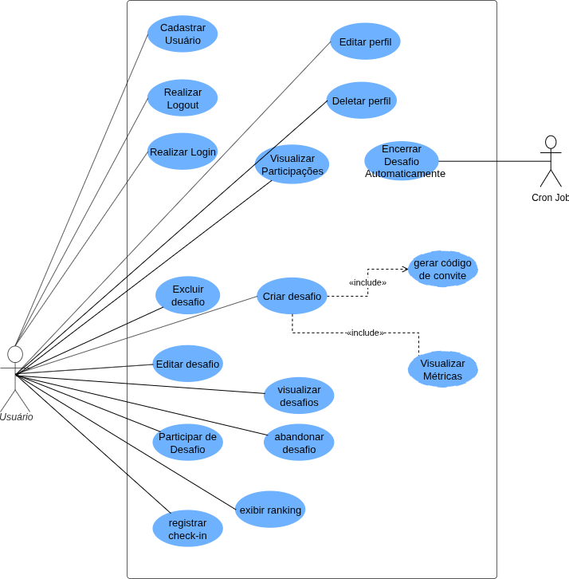
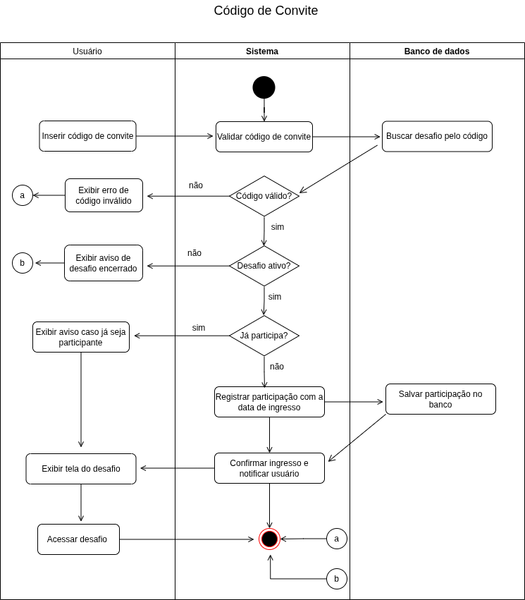
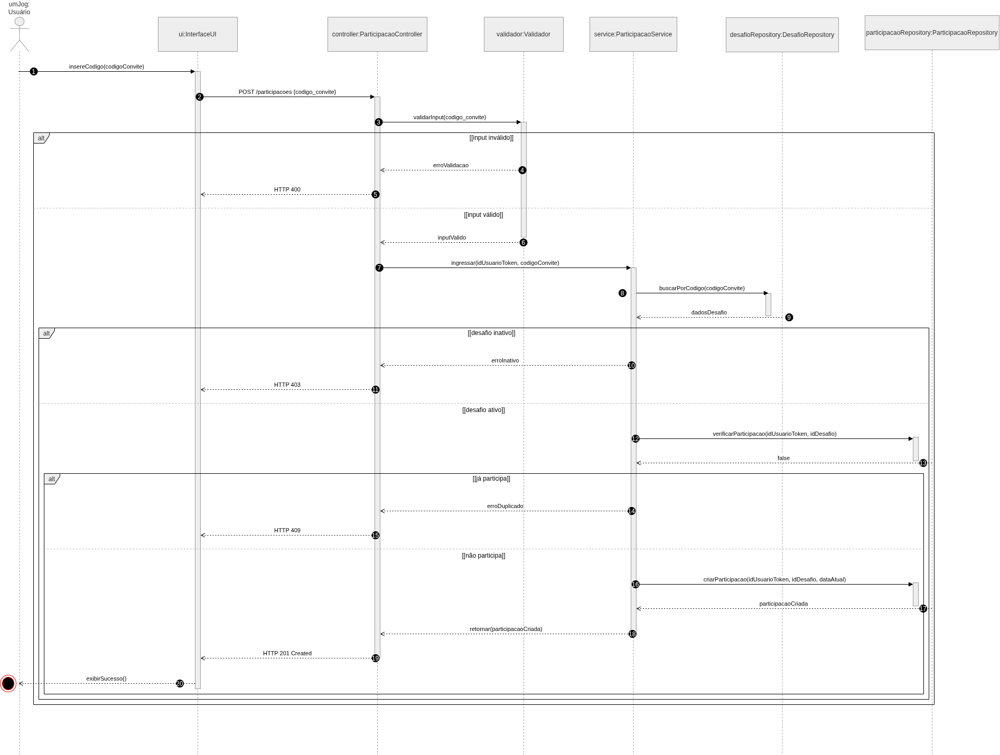
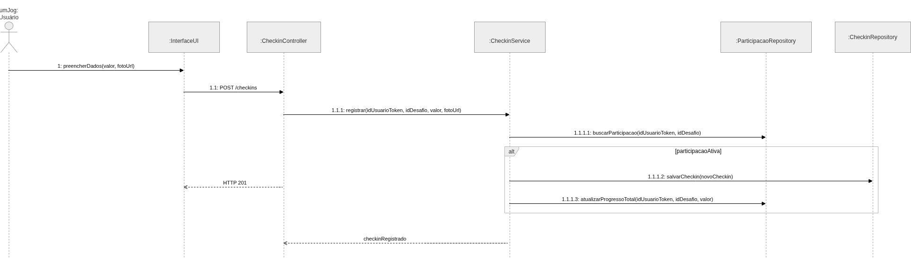

# FITEND

## Mini Mundo

O Fit End é uma plataforma de gamificação voltada para a criação e gestão de desafios de hábitos entre amigos. O foco é permitir que usuários criem competições saudáveis baseadas em métricas variadas (como ingestão de água, exercícios físicos ou leitura), incentivando a constância através de rankings e registros de progresso.
Para utilizar o sistema, o indivíduo deve realizar um cadastro fornecendo seu nome completo, e-mail, uma senha segura e, opcionalmente, uma foto de perfil. O sistema identifica cada usuário de forma única através de um identificador interno.
Qualquer usuário cadastrado pode atuar como um "Criador". Ao criar um Desafio, o usuário define um título, uma descrição detalhada, a data de início e a data de término da competição. No momento da criação, o sistema gera automaticamente um Código de Convite único, que será utilizado para que outros amigos entrem no desafio.
Cada desafio pertence obrigatoriamente a um único criador, que possui permissões administrativas sobre ele. O desafio possui um status (ex: Pendente, Ativo, Encerrado, Cancelado), permitindo que o criador encerre ou cancele o desafio manualmente antes da data final estipulada.
Para garantir a integridade dos dados, cada desafio deve estar vinculado a uma Métrica pré-definida e gerida exclusivamente pela administração do sistema (não pelos usuários comuns). Uma métrica define o nome (ex: Quilômetros), a sigla (ex: km) e o tipo de dado esperado (ex: numérico ou booleano). Isso garante padronização nos registros de todos os desafios da plataforma.
Um usuário pode participar de múltiplos desafios simultaneamente ao inserir o código de convite correspondente. Ao ingressar, o sistema registra a data de ingresso do participante. Para cada desafio em que está inscrito, o usuário possui um progresso total. Este é um atributo derivado, ou seja, não é um dado solto, mas sim calculado matematicamente a partir da soma de todas as entregas realizadas por aquele usuário naquele desafio.
O coração do sistema é o Check-in. Durante o período de vigência de um desafio ativo, o participante deve realizar registros de suas atividades. Em cada check-in, o usuário informa o valor realizado (ex: 500 para ml d'água), a data/hora do registro e pode anexar uma foto como comprovante visual da atividade. Cada check-in está estritamente ligado à participação daquele usuário naquele desafio específico.
O sistema utiliza os dados dos check-ins para gerar rankings de desempenho entre os participantes do desafio em tempo real.

## Modelo Conceitual

<div align="center">
  <h3>Diagrama de Classe</h3>
  
</div>

<div align="center">
  <h3>Diagrama de Caso de Uso</h3>
  
</div>

<div align="center">
  <h3>Diagrama de Atividade — Convite</h3>
  
</div>

<div align="center">
  <h3>Diagrama de Sequência</h3>
  
</div>

<div align="center">
  <h3>Diagrama de Comunicação</h3>
  
</div>

## Como Rodar

### Pré-requisitos

- Node.js 20+
- Docker e Docker Compose (para o banco PostgreSQL)
- Expo Go (no celular) ou emulador Android/iOS

### 1. Banco de Dados

```bash
docker compose up -d
```

### 2. Backend

```bash
cd backend
cp .env.example .env        # se ainda não existir
npm install
npx prisma migrate dev      # cria as tabelas
npm run seed                # popula as métricas
npm run dev                 # inicia em http://localhost:3000
```

### 3. Frontend (Mobile)

```bash
cd FitEnd
npm install
npx expo start              # escaneie o QR Code com Expo Go
```

### Estrutura do Projeto

```
fitend-modulo/
├── backend/
│   ├── prisma/
│   │   ├── schema.prisma   # modelo do banco
│   │   └── seed.js         # dados iniciais (métricas)
│   ├── src/
│   │   ├── controllers/    # entrada das requisições
│   │   ├── services/       # regras de negócio
│   │   ├── mappers/        # formatação das respostas
│   │   ├── middlewares/     # auth JWT, error handler
│   │   ├── validators/     # schemas Zod
│   │   └── routes/         # definição das rotas
│   └── uploads/            # fotos enviadas pelos usuários
├── FitEnd/
│   ├── screens/            # telas do app
│   ├── src/
│   │   ├── contexts/       # AuthContext
│   │   └── services/       # api.js (cliente HTTP)
│   └── assets/             # imagens estáticas
├── img/                    # diagramas do projeto
└── docker-compose.yml
```

## Esquema do Banco de Dados

### Estrutura das Tabelas

```sql
-- Enum: StatusDesafio (Pendente, Ativo, Encerrado, Cancelado)
-- Enum: TipoDado (numerico, booleano)

CREATE TABLE Usuario (
  id_usuario UUID PRIMARY KEY DEFAULT gen_random_uuid(),
  nome       VARCHAR(255) NOT NULL,
  email      VARCHAR(255) NOT NULL UNIQUE,
  senha      VARCHAR(255) NOT NULL,
  foto       TEXT,
  created_at TIMESTAMP DEFAULT NOW(),
  updated_at TIMESTAMP DEFAULT NOW()
);

CREATE TABLE Metrica (
  id_metrica UUID PRIMARY KEY DEFAULT gen_random_uuid(),
  nome       VARCHAR(255) NOT NULL UNIQUE,
  sigla      VARCHAR(50)  NOT NULL,
  tipo_dado  VARCHAR(20)  NOT NULL,  -- 'numerico' | 'booleano'
  created_at TIMESTAMP DEFAULT NOW()
);

CREATE TABLE Desafio (
  id_desafio  UUID PRIMARY KEY DEFAULT gen_random_uuid(),
  titulo      VARCHAR(255) NOT NULL,
  descricao   TEXT NOT NULL,
  data_inicio TIMESTAMP NOT NULL,
  data_fim    TIMESTAMP NOT NULL,
  status      VARCHAR(20) NOT NULL DEFAULT 'Pendente',
  cod_convite VARCHAR(20) NOT NULL UNIQUE,
  criador_id  UUID NOT NULL REFERENCES Usuario(id_usuario),
  metrica_id  UUID NOT NULL REFERENCES Metrica(id_metrica),
  created_at  TIMESTAMP DEFAULT NOW(),
  updated_at  TIMESTAMP DEFAULT NOW()
);

CREATE TABLE Participacao (
  id_participante UUID PRIMARY KEY DEFAULT gen_random_uuid(),
  usuario_id      UUID NOT NULL REFERENCES Usuario(id_usuario),
  desafio_id      UUID NOT NULL REFERENCES Desafio(id_desafio),
  data_ingresso   TIMESTAMP DEFAULT NOW(),
  progresso_total FLOAT DEFAULT 0,
  created_at      TIMESTAMP DEFAULT NOW(),
  UNIQUE (usuario_id, desafio_id)
);

CREATE TABLE Checkin (
  id_checkin       UUID PRIMARY KEY DEFAULT gen_random_uuid(),
  participacao_id  UUID NOT NULL REFERENCES Participacao(id_participante),
  data_hora        TIMESTAMP DEFAULT NOW(),
  valor_registrado FLOAT NOT NULL,
  foto_url         TEXT,
  created_at       TIMESTAMP DEFAULT NOW()
);
```


